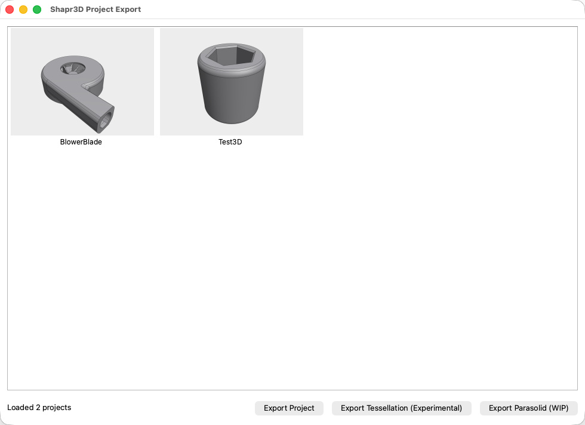

# Shapr3D Export Tool

A small desktop utility (PySide6 + sqlite3) to browse local Shapr3D projects and export data.



## Disclaimer

This project is intended for educational and research use, and is provided "as is," without any warranty.

By using this project, you acknowledge that you are doing so at your own risk and that you are responsible for ensuring that your use of this project complies with all applicable laws, regulations, and terms of service.

## Features

- Project browser grid with thumbnail + project name
- Export project to `.shapr`
- Export tessellation to `.stl` (experimental)
- Export Parasolid (work in progress)

## How It Works

The app reads your local Shapr3D project database and loads projects. You can select a project and choose to export it in different formats.

## Requirements

- Python 3.10+
- Shapr3D installed with local project data

## Install

```bash
python3 -m venv venv
source venv/bin/activate
pip install -r requirements.txt
```

## Run

```bash
source venv/bin/activate
python app.py
```

## STL Export Comparison

| Export Method                | Vertices | Triangles |
| ---------------------------- | -------: | --------: |
| Web export trick             |    9,014 |    10,946 |
| **This tool**                |   56,991 |    18,997 |
| Shapr3D High Resolution      |  102,516 |    34,172 |

## License

This project is licensed under the GNU Affero General Public License v3.0 only.
See [LICENSE](LICENSE) for details.

## TODO

- [ ] Windows support
- [ ] Disable Shapr3D Cloud Sync
- [ ] Use theme-matched thumbnails
- [ ] Reconstruct tessellation without opening Shapr3D
- [ ] Export Parasolid / STEP
